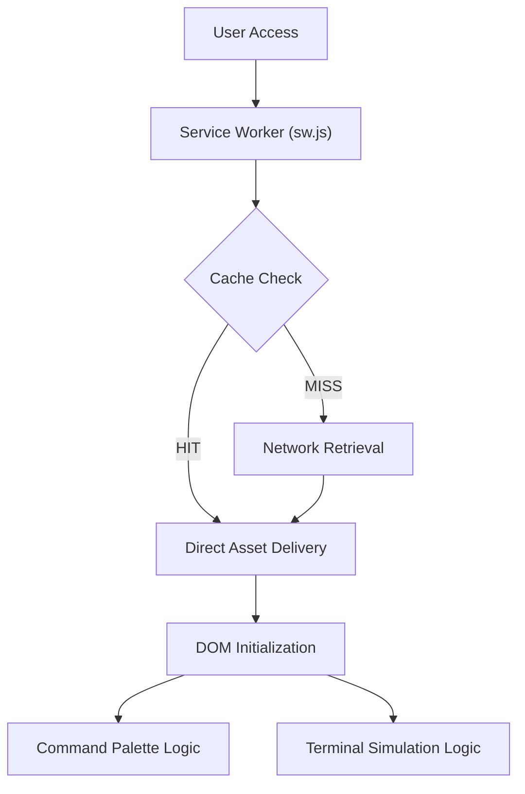

# Technical Specification: Archit Konde — Machine Learning Portfolio

## Architectural Overview

**Archit Konde — Machine Learning Portfolio** is an advanced, terminal-inspired static application designed to showcase a professional engineering record and technical research. The architecture prioritizes low-latency performance, structural integrity, and deep integration with modern web standards to provide a scholarly user experience.

### System Flow and Lifecycle

---

## Technical Implementations

### 1. High-Precision Interface
- **Terminal Simulation**: Engineered a macOS-inspired terminal window using CSS Flexbox and pseudo-elements. Interactive elements utilize Vanilla JavaScript to simulate asynchronous command execution and "typewriter" telemetry.
- **Command Palette**: Implemented a global orchestration layer accessible via `Ctrl+K` / `Cmd+K`. This provides a centralized navigation hub, reducing time-to-action for technical visitors.

### 2. Progressive Web Architecture (PWA)
- **Persistence Layer**: Employs a robust Service Worker (`sw.js`) with a cache-first strategy for static assets and a network-first strategy for navigation. This ensures continuous availability even in offline or unstable network environments.
- **Manifest Integration**: Configured with a `manifest.json` for native platform installation, utilizing high-resolution SVG iconography for visual fidelity across device types.

### 3. SEO and Metadata Layer
- **Structured Data**: Integrated `Schema.org/Person` JSON-LD to provide search engines with a high-dimensional understanding of professional expertise and alumni history.
- **Header Meta Information**: Optimized with Open Graph and Twitter/X metadata cards to ensure professional preview rendering across LinkedIn and scholarly forums.

### 4. Performance and Optimization
- **Latency Budget**: Targeted sub-200ms DOM Interactive time for cached visits. The Service Worker strategy ensures that core structural assets are delivered with zero network latency upon subsequent sessions.
- **Asset Compression**: Utilizes high-resolution SVG iconography instead of raster images, significantly reducing the payload size while maintaining visual fidelity across 4K displays.

### 5. Security Posture
- **Static Delivery**: The absence of server-side execution eliminates common vectors like SQL Injection or Remote Code Execution.
- **Header Implementation**: Future iterations will incorporate specialized Content Security Policies (CSP) to further harden the client-side sandbox.

---

## Deployment Strategy

- **Automation**: Continuous Deployment executed via **GitHub Actions**, synchronizing the `Source Code` directory to the production environment on every legitimate push.
- **Integrity**: Each release is tracked through the main branch, maintaining a definitive scholarly record of the site's evolution.

### 6. Technical Maintenance and Versioning
- **Maintenance Protocols**: All repository updates follow strictly defined naming conventions to ensure a clear scholarly history.
- **Collaborative Integrity**: Joint author attribution is utilized for cross-functional updates to preserve the intellectual lineage of the codebase.

---

*Technical Specification | Static Architecture | Version 1.2*
