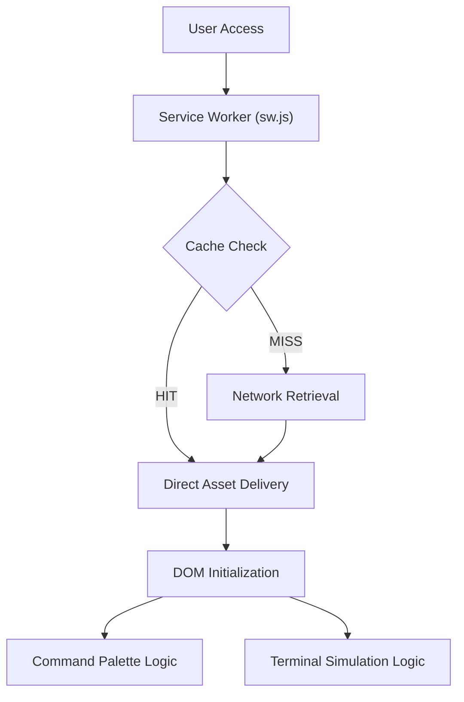

# Technical Specification: Archit Konde — Machine Learning Portfolio

## Architectural Overview

**Archit Konde — Machine Learning Portfolio** is an advanced, terminal-inspired static application designed to showcase a professional engineering record and technical research. The architecture prioritizes low-latency performance, structural integrity, and deep integration with modern web standards to provide a scholarly user experience.

### System Flow and Lifecycle

---

## Technical Implementations

### 1. High-Precision Interface
- **Terminal Simulation**: Engineered a macOS-inspired terminal window using CSS Flexbox and pseudo-elements. Interactive elements utilize Vanilla JavaScript to simulate asynchronous command execution and "typewriter" telemetry.
- **Command Palette**: Implemented a global orchestration layer accessible via `Ctrl+K` / `Cmd+K`. This provides a centralized navigation hub, reducing time-to-action for technical visitors.

### 2. Progressive Web Architecture (PWA)
- **Persistence Layer**: Employs a robust Service Worker (`sw.js`) with a cache-first strategy for static assets and a network-first strategy for navigation. This ensures continuous availability even in offline or unstable network environments.
- **Manifest Integration**: Configured with a `manifest.json` for native platform installation, utilizing high-resolution SVG iconography for visual fidelity across device types.

### 3. SEO and Metadata Layer
- **Structured Data**: Integrated `Schema.org/Person` JSON-LD to provide search engines with a high-dimensional understanding of professional expertise and alumni history.
- **Header Meta Information**: Optimized with Open Graph and Twitter/X metadata cards to ensure professional preview rendering across LinkedIn and scholarly forums.

---

## Deployment Logic

- **Pipeline**: Automated CI/CD execution via **GitHub Actions**, triggering on commits to the `main` branch.
- **Hosting**: Served exclusively through **GitHub Pages**, utilizing a specialized directory structure to separate repo documentation from production source code.

---

*Technical Specification | Static Architecture | Version 1.0*
